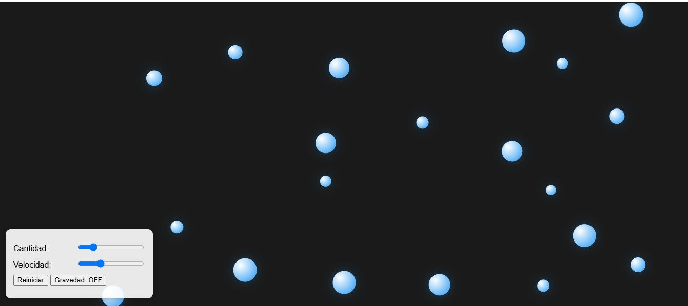

# Proyecto de Sistema de Partículas

Este proyecto incluye un sistema de partículas interactivo con características avanzadas y efectos visuales impresionantes. A continuación se detallan sus componentes y funcionalidades:

## Sistema de Partículas

- **Esferas con tamaños aleatorios**: Cada esfera tiene un tamaño único generado aleatoriamente.
- **Movimiento físico realista**: Las esferas se mueven con velocidad y aceleración, simulando un comportamiento físico realista.
- **Rebotes elásticos en los bordes**: Las esferas rebotan en los bordes del contenedor con una respuesta elástica.
- **Detección básica de colisiones**: El sistema detecta colisiones entre esferas y responde en consecuencia.
- **Efectos de fricción y gravedad**: Las esferas están sujetas a fuerzas de fricción y gravedad, afectando su movimiento.
